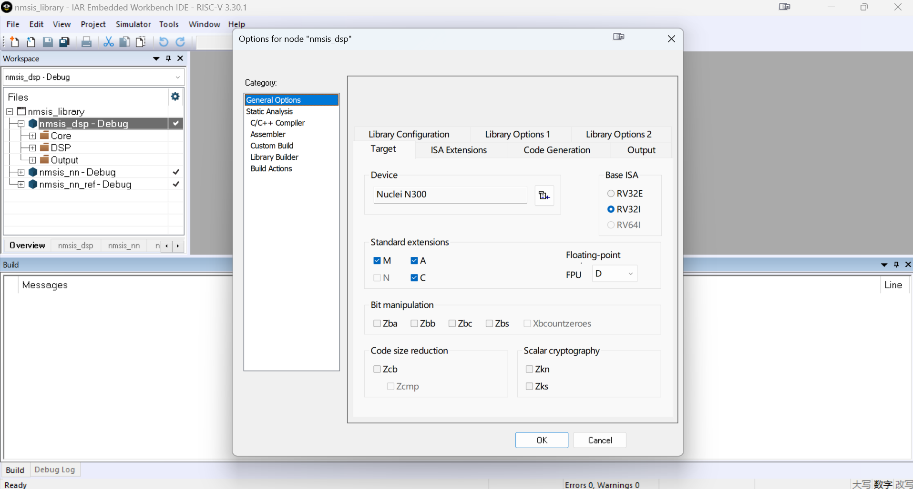

# IAR Embedded Workbench IDE Projects For Nuclei Processors

In this folder, we provided a prebuilt IAR workspace(for IAR RISC-V version 3.30.1) to build NMSIS DSP/NN libraries, and NN Reference library for testing NN.

> You can refer to these demo projects to build your own iar projects.

> If you want to evaluate Nuclei N300 DSP feature(P-ext 0.5.4), you can change the file `C:\Program Files\IAR Systems\Embedded Workbench 9.2\riscv\config\devices\Nuclei\N300.menu`, change `RV32IMAFDCB_Zkn_Zks_Zcb_Zcmp` to `RV32IMAFDCB_Zkn_Zks_Zcb_Zcmp_Xandesdsp`, `Xandesdsp` is based on P-ext 0.5.0, there are some intruction encoding updates from 0.5.0 to 0.5.4, and we use IAR custom instruction intrinsic to implement the different instructions, please check `NMSIS/Core/core_feature_dsp.h` for details, and in future, we will co-operate with IAR to support full Nuclei DSP feature including(N1/N2/N3 custom enhancement instructions).

These projects demonstrated the following features:

- Provide support for Nuclei Evaluation SoC which is a prototype and evaluation SoC mainly
  used to evaluate Nuclei RISC-V processor such as 200/300/600/900 series.
- By default, RISC-V Extension IMAFDC are selected in this project, and the optimization level is "High Speed".
- If you want to **enable P extension**, choose ``Xandesdsp``(based on P-ext 0.5.0) option in IAR project settings: the Options->General Options-> ISA Extensions->DSP.
  > And don't choose "P", which generates no __riscv_dsp macro

  > NN Reference library must build with **None DSP**

- Currently both Nuclei RV32 and RV64 processors are supported in this project.
- When building done, the generated library with **.a** suffix is placed in "NMSIS\ideprojects\iar\Debug\Exe"

You can directly try with this iar workspace by click this nmsis.eww after you have installed [IAR Workbench](https://www.iar.com/riscv).

For more details about how to use IAR workbench, please refer to its user guides.
